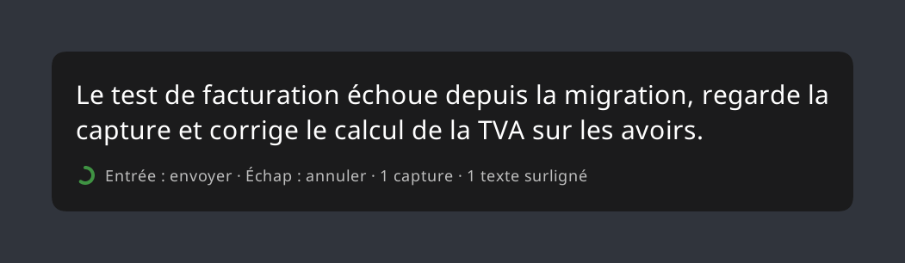

# 📻 Walkie Talkie Linux

Dictée vocale sous Linux X11 : ce que tu dis est tapé dans la fenêtre qui a le focus — terminal (Claude Code…), éditeur, navigateur, messagerie.
Inspiré de [victorrentea/walkie-talkie](https://github.com/victorrentea/walkie-talkie), l'overlay macOS de Victor Rentea — réécrit de zéro en Rust, sans reprise de code.

<p align="center">
  
  <br><sub>le texte dicté, 5 s pour relire avant l'envoi</sub>
</p>

## Utilisation

1. Mettre le focus sur la fenêtre où écrire (n'importe laquelle).
2. <kbd>Super</kbd>+<kbd>Q</kbd> : le micro s'ouvre (notification « 🎙️ Écoute… »). Parler. Pendant la dictée, on peut joindre du contexte au prompt :
   - **texte surligné** : tout texte sélectionné à la souris pendant la dictée est joint (une sélection faite avant la dictée est ignorée) ;
   - **capture d'écran** : <kbd>Super</kbd>+<kbd>W</kbd> fige l'écran, puis **glisser** pour capturer une zone, **cliquer** sur une fenêtre pour la capturer entière, ou <kbd>Échap</kbd> pour renoncer. Autant de fois que voulu ; PNG dans `~/.cache/walkie-talkie/shots/`. Sans `slop` installé, la capture prend tout l'écran sous la souris.

   La notification compte les pièces jointes (📸 captures · ✂️ sélections).
3. **Se taire 2 s** (ou <kbd>Super</kbd>+<kbd>Q</kbd> à nouveau) : le micro se ferme, la fenêtre active à cet instant est retenue comme cible, la transcription démarre (Whisper en local, rien ne sort de la machine).
4. Le texte s'affiche en gros dans un panneau **au centre de l'écran où se trouve le curseur**, avec un anneau vert qui se vide, puis part **5 s plus tard** dans la fenêtre retenue, suivi d'Entrée (sans police système, une notification GNOME le remplace). Pendant ces 5 s :
   - <kbd>Entrée</kbd> : envoyer tout de suite ;
   - <kbd>Échap</kbd> ou <kbd>Super</kbd>+<kbd>Q</kbd> : annuler.
5. Un indicateur suit le curseur pendant tout le cycle :

   

   - 🔴 pendant l'écoute : rond rouge et forme d'onde du micro — barres **rouges** quand le son dépasse le seuil de parole, **grises** pour le bruit de fond (un point blanc par pièce jointe). Si tout reste rouge alors que tu ne parles plus, le micro capte autre chose (musique, son d'un call) et l'arrêt automatique ne se déclenchera pas ;
   - 🟠 arc orange qui tourne pendant la transcription ;
   - 🟢 anneau vert qui se vide pendant les 5 s d'attente.

   Il laisse passer les clics et disparaît pendant les captures d'écran.
6. Le prompt est tapé sur une seule ligne (un retour à la ligne l'enverrait trop tôt), texte surligné à la suite. Les captures dépendent de la fenêtre cible :
   - **terminal** (Ghostty, GNOME Terminal, kitty, IntelliJ…) : leur chemin est ajouté, Claude Code ouvre l'image à partir de lui —
     `Corrige ça [texte sélectionné : « let x = 42; »] [capture d'écran : /home/moi/.cache/walkie-talkie/shots/shot-1791546302537.png]` ;
   - **autre application** (Teams, Slack, appli Claude, navigateur…) : l'image elle-même est collée dans le message après le texte.
7. Les annotations de bruit que Whisper ajoute (`*Bruit de la porte*`, `[Musique]`, `(rires)`) sont retirées du texte.
8. Le presse-papiers garde toujours le dernier prompt (<kbd>Ctrl</kbd>+<kbd>Shift</kbd>+<kbd>V</kbd> pour la recoller dans un terminal).

### Dictée simple (sans Entrée)

<kbd>Super</kbd>+<kbd>E</kbd> au lieu de <kbd>Super</kbd>+<kbd>Q</kbd> : même déroulé, mais le texte est seulement **écrit** là où est le curseur, **sans appuyer sur Entrée** — pour Slack, un éditeur, un formulaire, quand on veut relire ou compléter avant d'envoyer. Pas de pièce jointe dans ce mode (ni capture, ni texte surligné). L'indicateur est **bleu** au lieu de rouge. Le silence ou l'un des deux raccourcis arrête la dictée.

⚠️ Le texte est tapé dans la fenêtre retenue, quelle qu'elle soit (y compris un shell), puis Entrée est pressée : dans une messagerie ou un formulaire, ça envoie.
⚠️ Pendant les 5 s d'attente, Entrée et Échap sont captées par Walkie Talkie et n'arrivent pas aux autres applications.
⚠️ Les captures s'accumulent dans `~/.cache/walkie-talkie/shots/` ; les supprimer de temps en temps.

## Installation

Testé sur Ubuntu 22.04 / 24.04, GNOME, X11 (pas Wayland : `xdotool` et la capture des touches en dépendent).

### Option A — binaire précompilé (recommandé)

Binaire x86_64, transcription sur CPU (processeur avec AVX2 : Intel depuis 2013, AMD depuis 2015), glibc ≥ 2.35.

```bash
sudo apt install xdotool xclip slop
```

```bash
curl -fsSL https://github.com/NoxFr/walkie-talkie-linux/releases/latest/download/walkie-talkie-linux-x86_64.tar.gz | tar xz
```

```bash
./walkie-talkie-linux-x86_64/install.sh
```

Le binaire est installé dans `~/.local/bin/walkie-talkie`. Pour mettre à jour : refaire les deux dernières commandes.

### Option B — depuis les sources (pour le GPU NVIDIA)

```bash
sudo apt install xdotool xclip slop cmake clang
```

Rust doit être installé ([rustup](https://rustup.rs)). Pour le GPU NVIDIA (optionnel) :

```bash
sudo apt install nvidia-cuda-toolkit g++-12
```

Gain modeste avec le modèle `small` sur un petit GPU (voir [Performances](#performances)) ; plus utile pour `medium` ou pour laisser le CPU libre. Le CUDA 12.0 d'Ubuntu refuse le gcc 13 du système : `install.sh` utilise automatiquement `g++-12` comme compilateur hôte. La compilation CUDA prend ~5 min la première fois.

```bash
git clone https://github.com/NoxFr/walkie-talkie-linux && cd walkie-talkie-linux && ./install.sh
```

Le binaire est compilé et installé dans `~/.cargo/bin/walkie-talkie`, avec CUDA si `nvcc` est présent. Relancer `./install.sh` après une mise à jour du code.

### Ce que fait `install.sh` (les deux options)

- télécharge le modèle `ggml-small.bin` (~466 Mo) dans `~/.local/share/walkie-talkie/` ;
- crée et démarre le service utilisateur systemd `walkie-talkie` (lancé avec la session graphique) ;
- ajoute les raccourcis GNOME <kbd>Super</kbd>+<kbd>Q</kbd> (dictée), <kbd>Super</kbd>+<kbd>E</kbd> (dictée simple) et <kbd>Super</kbd>+<kbd>W</kbd> (capture) — <kbd>Super</kbd> = touche Windows — et retire <kbd>Super</kbd>+<kbd>Q</kbd> du Dock Ubuntu, qui l'utilise pour afficher ses numéros d'applications (<kbd>Super</kbd>+<kbd>1</kbd>…<kbd>9</kbd> restent actifs). Pour rendre la touche au Dock : `gsettings set org.gnome.shell.extensions.dash-to-dock shortcut "['<Super>q']"`.

`pw-record` (PipeWire), `notify-send` et `curl` sont présents par défaut sur Ubuntu. `slop` (sélection de zone pour les captures) est optionnel.

### Micro

Un micro trop bas donne une transcription fantaisiste. Vérifier le volume d'entrée (Paramètres → Son → Entrée) ou :

```bash
wpctl get-volume @DEFAULT_AUDIO_SOURCE@
```

```bash
wpctl set-volume @DEFAULT_AUDIO_SOURCE@ 1.0
```

Couper la musique pendant la dictée : elle est captée par le micro.

## Réglages

Variables d'environnement du service (à ajouter dans `~/.config/systemd/user/walkie-talkie.service`, section `[Service]`, puis `systemctl --user daemon-reload && systemctl --user restart walkie-talkie` ; `install.sh` réécrit ce fichier, à refaire après une réinstallation) :

| variable | défaut | rôle |
|---|---|---|
| `WALKIE_LANG` | `fr` | langue (`en`, `auto`… ; `auto` double le temps de transcription) |
| `WALKIE_HOLD` | `5` | secondes avant envoi |
| `WALKIE_SILENCE` | `2` | secondes de silence après la parole qui ferment le micro (`0` : arrêt manuel uniquement) |
| `WALKIE_MODEL` | `~/.local/share/walkie-talkie/ggml-small.bin` | modèle whisper.cpp |

Variables de `install.sh` :

| variable | défaut | rôle |
|---|---|---|
| `WALKIE_SHORTCUT` | `<Super>q` | raccourci GNOME de la dictée |
| `WALKIE_SHOT_SHORTCUT` | `<Super>w` | raccourci GNOME de la capture d'écran |
| `WALKIE_PLAIN_SHORTCUT` | `<Super>e` | raccourci GNOME de la dictée simple (sans Entrée) |
| `WALKIE_MODEL_NAME` | `small` | modèle à télécharger (`base`, `medium`… ; `medium` est plus précis, raisonnable avec un GPU) |

Exemple : `WALKIE_MODEL_NAME=medium ./install.sh`

## Performances

Temps de transcription d'une phrase de 4,5 s, langue `fr`, 4 passes :

| matériel | `small` (466 Mo) | `medium` (1,5 Go) |
|---|---|---|
| CPU Intel i7-12700H (10 threads) | 2,6 – 2,8 s | 7,4 – 8,1 s |
| GPU NVIDIA T600 Laptop 4 Go (CUDA 12.0) | 1,8 – 2,8 s | 4,7 – 4,8 s |

Whisper traite toujours une fenêtre de 30 s : le temps varie peu avec la longueur de la phrase. `WALKIE_LANG=auto` ajoute une détection de langue qui double à peu près le temps.

## Tests et CI

```bash
cargo test
```

Tester la transcription d'un fichier WAV (16 kHz mono 16 bits), utile pour vérifier le micro ou un modèle :

```bash
walkie-talkie transcribe fichier.wav
```

Les images de ce README sont dessinées par le code de l'indicateur et du panneau ; après une modification de leur rendu :

```bash
cargo test -- --ignored readme
```

La CI GitHub Actions (`.github/workflows/ci.yml`) lance les tests, compile un binaire portable et vérifie une transcription réelle (phrase synthétisée par `espeak-ng`, modèle `base`).

## Publier une release

```bash
git tag v0.2.0 && git push origin v0.2.0
```

Le workflow `release.yml` rejoue la CI puis publie `walkie-talkie-linux-x86_64.tar.gz` (binaire + `install.sh` + README) et sa somme SHA-256 sur la page Releases.

## Dépannage

```bash
journalctl --user -u walkie-talkie -f
```

- **Rien ne se passe au raccourci** : vérifier que le service tourne (`systemctl --user status walkie-talkie`) et qu'aucune autre application ne capte <kbd>Super</kbd>+<kbd>Q</kbd> (`gsettings list-recursively | grep "<Super>q"`).
- **« no GPU found » dans les logs** : le binaire est compilé sans CUDA ; installer `nvidia-cuda-toolkit` puis relancer `./install.sh`.
- **Transcription incompréhensible** : volume du micro, bruit de fond, ou langue (`WALKIE_LANG`).
- **Le micro se coupe trop tôt ou jamais** : le seuil s'adapte au bruit de fond (5 × le bruit ambiant, au moins 1000) ; augmenter `WALKIE_SILENCE` si tu fais de longues pauses, ou `0` pour couper uniquement au raccourci.
- **Pas d'indicateur près du curseur** : il faut un compositeur (GNOME X11 en a un).
- **« ❌ Micro indisponible »** : `pw-record` n'a pas pu démarrer — PipeWire ne tourne pas encore (juste après la connexion) ou n'est pas installé.
- **« ❌ Transcription impossible »** : Whisper n'a pas pu s'exécuter, le plus souvent faute de mémoire GPU (modèle `medium` + d'autres applications sur une petite carte) ; repasser sur `small` (`./install.sh`) ou fermer ce qui occupe le GPU.
- **« Rien entendu » pendant un call** : avec des haut-parleurs, le micro capte aussi le son du call ; Whisper prend souvent ce mélange pour de la musique (`[Musique]`, retiré du texte). Utiliser un casque pendant les calls.
